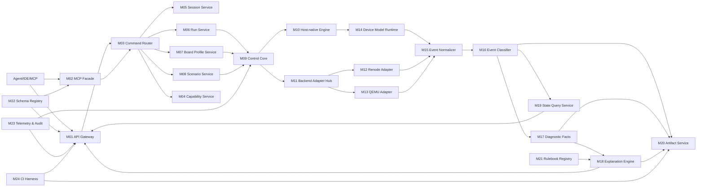

# 架构到实现模块映射（模块清单与联动关系）

版本：v1.0  
日期：2026-04-06  
参考文件：
1. `deep-research-report (2).md`
2. `architecture_report_new.md`
3. `architecture_report_v2_new.md`

---

## 1. 目标

把现有架构报告抽象成可实施的“模块级蓝图”，明确：

1. 有哪些实现模块。  
2. 每个模块的职责边界。  
3. 模块之间如何联动（调用链、数据流、事件流）。

说明：本文件只做模块设计，不涉及具体代码实现。

---

## 2. 实现模块总览

| 模块ID | 模块名 | 主要职责 | 上游输入 | 下游输出 |
|---|---|---|---|---|
| M01 | API Gateway | REST/JSON-RPC 接入、鉴权、限流、基础校验 | Agent/IDE 请求 | 规范化命令请求 |
| M02 | MCP Tool Facade | MCP 工具封装与 schema 暴露 | MCP 客户端调用 | 标准命令请求（转给 M01/M03） |
| M03 | Command Router | 命令路由、幂等处理、同步/异步分发 | M01/M02 | Session/Run 命令、IO 命令 |
| M04 | Capability Service | 返回后端、总线、设备、规则能力 | M03 查询 | capabilities 响应 |
| M05 | Session Service | 会话生命周期管理 | create/list/close session | session_id 与会话元数据 |
| M06 | Run Service | Run 生命周期（start/step/finalize） | M03 命令 | run_id、run 状态 |
| M07 | Board Profile Service | board_profile 解析、校验、加载 | board_profile.yaml | 结构化硬件拓扑 |
| M08 | Scenario Service | DSL 解析、setup/stimulus/assertions 调度 | scenario.yaml | 可执行场景计划 |
| M09 | Control Core (Orchestrator) | 统一控制平面、执行编排、模式切换 | M06/M07/M08 | 执行指令给执行层 |
| M10 | Host-native Execution Engine | 协议级仿真执行（Mode A 强控制） | M09 指令 | 原始仿真事件 |
| M11 | Backend Adapter Hub | 统一外部后端适配入口 | M09 指令 | 后端原始事件 |
| M12 | Renode Adapter | 映射 Renode 控制与观测（Mode B） | M11 | 后端事件流 |
| M13 | QEMU Adapter | 映射 QMP 控制与观测（Mode B） | M11 | 后端事件流 |
| M14 | Device Model Runtime | 总线模型与设备插件运行时（GPIO/UART/I2C/SPI/ADC） | M10 执行上下文 | 设备级事件与状态 |
| M15 | Event Normalizer | 多后端事件归一化、统一事件模型 | M10/M12/M13/M14 | 统一 Raw Events |
| M16 | Event Classifier | 事件分级（L0~L3）、采样/限流 | M15 | 分级事件流 |
| M17 | Diagnostic Facts Engine | 从 Raw Events 提取诊断事实 | M16 | Diagnostic Facts |
| M18 | Explanation Engine | 候选原因、证据链、下一步动作 | M17 + 规则库 + Board 信息 | explain/hypothesis 输出 |
| M19 | State Query Service | 统一状态快照查询（run/session/device） | M15/M16 | state API 响应 |
| M20 | Artifact Service | 产物落盘与最小复现包导出 | M16/M17/M18/M06 | trace/events/facts/repro bundle |
| M21 | Rulebook Registry | 解释规则与版本管理 | 规则配置 | 规则查找接口 |
| M22 | Schema Registry | JSON Schema/OpenAPI/MCP schema 版本管理 | 协议定义 | 校验与文档服务 |
| M23 | Telemetry & Audit | 指标、审计日志、错误统计 | 全链路埋点 | 可观测性报表 |
| M24 | CI Harness | 场景即测试、回归执行、基线比对 | 场景集 + 固件/配置 | CI 结果与差异报告 |

---

## 3. 模块分层

### 3.1 接入层

1. M01 API Gateway  
2. M02 MCP Tool Facade  
3. M22 Schema Registry

### 3.2 控制层

1. M03 Command Router  
2. M04 Capability Service  
3. M05 Session Service  
4. M06 Run Service  
5. M07 Board Profile Service  
6. M08 Scenario Service  
7. M09 Control Core

### 3.3 执行层

1. M10 Host-native Execution Engine  
2. M11 Backend Adapter Hub  
3. M12 Renode Adapter  
4. M13 QEMU Adapter  
5. M14 Device Model Runtime

### 3.4 诊断解释层

1. M15 Event Normalizer  
2. M16 Event Classifier  
3. M17 Diagnostic Facts Engine  
4. M18 Explanation Engine  
5. M21 Rulebook Registry

### 3.5 数据与运维层

1. M19 State Query Service  
2. M20 Artifact Service  
3. M23 Telemetry & Audit  
4. M24 CI Harness

---

## 4. 核心联动关系（模块到模块）

### 4.1 命令主链路

M01/M02 -> M03 -> M05/M06 -> M07/M08 -> M09 -> (M10 或 M11) -> M12/M13/M14 -> M15 -> M16 -> M17 -> M18 -> M20 -> M19 -> M01

### 4.2 关键联动说明

1. M03 与 M22 联动：所有请求先做 schema 校验。  
2. M06 与 M09 联动：Run 的执行控制由 Orchestrator 统一下发。  
3. M09 与执行层联动：按 run.mode 和 backend 选择 M10 或 M11。  
4. M11 与 M12/M13 联动：统一适配入口，屏蔽后端差异。  
5. M15~M18 联动：形成“事件 -> 事实 -> 解释”流水线。  
6. M20 与 M06 联动：所有工件必须绑定 run_id。  
7. M24 与 M08/M20 联动：CI 以场景驱动，产物用于基线比对。

---

## 5. 两种模式的模块联动

### 5.1 Mode A（Device-Simulation）

1. M01 -> M03 -> M06/M07/M08 -> M09  
2. M09 -> M10 -> M14 -> M15 -> M16 -> M17 -> M18  
3. M20 导出产物，M19 查询状态

特点：

1. 强控制：M09+M10 掌控时间推进与事件队列。  
2. 适合快速回归与配置问题定位。

### 5.2 Mode B（Firmware-in-the-Loop）

1. M01 -> M03 -> M06/M07/M08 -> M09  
2. M09 -> M11 -> (M12 或 M13) -> M15 -> M16 -> M17 -> M18  
3. M20 导出产物，M19 查询状态

特点：

1. 弱控制：执行由后端主导，平台负责编排与归一化。  
2. 适合真实固件路径问题定位。

---

## 6. 关键数据对象与归属模块

| 数据对象 | 归属模块 | 生产者 | 消费者 |
|---|---|---|---|
| Capability | M04 | M04 | M01/M02/Agent |
| Session | M05 | M05 | M03/M06/M20 |
| Run | M06 | M06 | M09/M20/M19 |
| BoardProfile | M07 | M07 | M09/M17/M18 |
| ScenarioPlan | M08 | M08 | M09/M24 |
| RawEvent | M15 | M10/M12/M13/M14 | M16/M19/M20 |
| ClassifiedEvent | M16 | M16 | M17/M20/M23 |
| DiagnosticFact | M17 | M17 | M18/M20 |
| ExplanationReport | M18 | M18 | M01/M20 |
| ReproBundle | M20 | M20 | Agent/CI/M24 |

---

## 7. 模块依赖约束（防止实现打架）

1. M14 不允许直接依赖 M18。  
2. M18 不允许直接读取后端私有事件格式，只能吃 M17 事实或 M16 统一事件。  
3. M12/M13 不允许直接写业务规则。  
4. M20 必须通过 M06 获取 run 元数据，不允许孤立落盘。  
5. M24 只调用公开 API，不绕过 M01/M03。

---

## 8. 建议实现优先级（模块批次）

### 批次 A（MVP 最小闭环）

1. M01 M03 M05 M06 M07 M08 M09  
2. M10 M14 M15 M16 M17 M18  
3. M19 M20 M22

目标：先跑通 Mode A 全链路。

### 批次 B（工程化）

1. M04 M21 M23 M24  
2. M02（MCP 入口）

目标：能力发现、规则版本化、可观测与 CI。

### 批次 C（扩展后端）

1. M11 M12（Renode）  
2. M13（QEMU）

目标：接入 Mode B，做跨后端语义一致性。

---

## 9. 一页式联动图

---

## 10. 结论

可以直接按“模块批次 + 模式分离 + 事件到事实到解释”推进落地：

1. 先完成 Mode A 的可执行闭环。  
2. 再补 MCP、CI、规则管理。  
3. 最后接 Renode/QEMU 做 Mode B 扩展。

这样能保证架构目标不漂移，同时每个阶段都能交付可运行结果。
