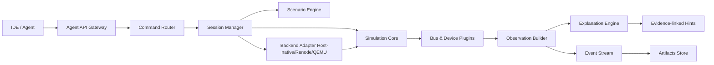

# 面向调试 Agent 的嵌入式模拟虚拟环境
## 详细架构设计报告（Architecture Report）

版本：v1.0（架构设计稿）  
日期：2026-04-06  
依据文档：`deep-research-report (2).md`

---

## 1. 文档目标与范围

### 1.1 目标
本报告给出一个可落地的系统架构方案，用于构建“可被调试 Agent 调用”的嵌入式虚拟调试环境。核心价值：

1. 让“硬件黑盒问题”变为可观测、可解释、可回放。  
2. 以轻量仿真覆盖高频配置类问题（GPIO/UART/I2C/SPI/ADC/RTOS时序）。  
3. 通过统一协议面向 IDE/代码 Agent 提供稳定调用能力。  
4. 兼容多后端（host-native 优先，Renode/QEMU 可插拔）。

### 1.2 范围边界（强约束）
本架构**优先解决**：

1. 配置类和时序类问题定位。  
2. 文本化“原因解释 + 证据链”输出。  
3. 场景脚本回放与 CI 回归。

本架构**不在 MVP 解决**：

1. 通用 MCU 二进制无修改高精度全覆盖仿真。  
2. 大规模寄存器级精确外设库。  
3. 默认启用 SPICE/周期级联合仿真（作为后续扩展）。

---

## 2. 架构设计原则

1. 解耦：仿真执行后端与 Agent 接口层彻底解耦。  
2. 确定性：同一 `scene + seed + firmware hash` 必须复现同一高层结果。  
3. 可解释：每个关键错误必须给出结构化证据与可读解释。  
4. 可演进：协议与 schema 必须版本化。  
5. 可测试：所有场景可自动化执行并形成回归基线。  
6. 轻量优先：先保证“可用、可调、可回归”，再提升仿真精度。

---

## 3. 总体架构

### 3.1 逻辑分层

1. 接入层（Access Layer）  
2. 控制层（Control Plane）  
3. 仿真层（Simulation Plane）  
4. 解释层（Explanation Plane）  
5. 数据层（Data & Artifacts Plane）  
6. 集成层（Backend Adapters）

### 3.2 总体数据流



---

## 4. 模块设计（职责与边界）

### 4.1 Agent API Gateway
职责：

1. 对外暴露 REST 与 JSON-RPC（stdio）双入口。  
2. 统一鉴权、限流、请求校验、错误封装。  
3. 输出稳定响应结构。

边界：

1. 不包含仿真逻辑。  
2. 不包含设备业务规则。

### 4.2 Command Router
职责：

1. 将外部调用映射为内部标准命令。  
2. 处理幂等键（`request_id`）。  
3. 管理同步响应与异步事件订阅。

### 4.3 Session Manager
职责：

1. 生命周期：`create/close/list/recover/export`。  
2. 维护会话上下文：硬件 profile、backend、seed、schema 版本。  
3. 保证会话级资源隔离。

### 4.4 Simulation Core
职责：

1. 统一虚拟时间（virtual clock）。  
2. 离散事件调度（event queue）。  
3. 步进策略：`step(ms)` / `run_until(condition)`。  
4. 将底层状态变更转换为标准观察事件。

### 4.5 Bus & Device Plugins
职责：

1. 总线语义：GPIO/UART/I2C/SPI/ADC。  
2. 设备语义：EEPROM/SPI Flash/传感器等。  
3. 提供标准插件契约（初始化、执行事务、状态快照、健康检查）。

边界：

1. 插件不感知外部 API 协议。  
2. 插件只输出“事实”，不直接输出“解释”。

### 4.6 Explanation Engine（核心差异化）
职责：

1. 消费观察事件与规则库。  
2. 生成 `explain + observations + next_actions`。  
3. 形成“证据绑定”的文本化反馈。

规则样例：

1. I2C NACK + SDA 长时间低电平 -> 候选原因：上拉不足/从设备占线。  
2. SPI 全 0xFF + CPOL/CPHA 不匹配 -> 候选原因：采样边沿配置错误。  
3. GPIO 写入无效 + 引脚非输出模式 -> 候选原因：方向配置错误。

### 4.7 Scenario Engine
职责：

1. 加载场景脚本（动作、触发、断言、故障注入）。  
2. 控制时间推进与事件注入。  
3. 支持最小复现包导出。

### 4.8 Artifacts Store
职责：

1. 存储结构化日志、事件流、状态快照、错误报告。  
2. 生成可复现包：`scene + seed + firmware hash + command trace`。  
3. 支持会话回放与差异比较。

### 4.9 Backend Adapters
职责：

1. Host-native 适配（MVP首选）。  
2. Renode/QEMU 控制面适配。  
3. 把后端差异统一映射为平台无关事件模型。

边界：

1. 后端能力差异通过 `capabilities` 显式暴露。  
2. 不在 Adapter 层硬编码解释规则。

---

## 5. 关键对象模型（Canonical Models）

### 5.1 命令模型 `SimCommand`

```json
{
  "api_version": "v1alpha1",
  "request_id": "req-uuid",
  "session_id": "sess-uuid",
  "cmd": "i2c.transact",
  "params": {
    "bus": "i2c0",
    "addr_7bit": 72,
    "write": [0],
    "read_len": 2,
    "timeout_ms": 10
  }
}
```

### 5.2 响应模型 `SimResponse`

```json
{
  "ok": false,
  "request_id": "req-uuid",
  "data": {},
  "error": {
    "error_code": "I2C_BUS_STUCK_LOW",
    "message": "I2C transact timeout",
    "details": {
      "bus": "i2c0",
      "timeout_ms": 10
    },
    "explain": "检测到 SDA 持续低电平，疑似上拉缺失或从设备占线。",
    "observations": [
      "SDA low for 12.3ms",
      "No rising edge after START"
    ],
    "next_actions": [
      "检查上拉电阻配置",
      "隔离从设备逐个验证"
    ]
  }
}
```

### 5.3 事件模型 `SimEvent`

```json
{
  "event_id": "evt-uuid",
  "session_id": "sess-uuid",
  "t_virtual_ns": 123456789,
  "t_wall_utc": "2026-04-06T09:00:00Z",
  "source": "device.i2c0",
  "type": "BUS_TIMEOUT",
  "severity": "warn",
  "payload": {
    "bus": "i2c0",
    "addr_7bit": 72
  },
  "evidence_refs": ["obs-1001", "obs-1002"]
}
```

---

## 6. 接口设计

### 6.1 对外 API（建议最小集合）

1. `GET /v1/capabilities`  
2. `POST /v1/sessions`  
3. `POST /v1/sessions/{sid}/scenario:load`  
4. `POST /v1/sessions/{sid}/step`  
5. `POST /v1/sessions/{sid}/run:until`  
6. `GET /v1/sessions/{sid}/state`  
7. `GET /v1/sessions/{sid}/events?since=...`  
8. `POST /v1/sessions/{sid}/io/i2c:transact`  
9. `POST /v1/sessions/{sid}/io/spi:transact`  
10. `POST /v1/sessions/{sid}/io/uart:write`  
11. `POST /v1/sessions/{sid}/io/gpio:set`  
12. `POST /v1/sessions/{sid}/artifacts:export`

### 6.2 协议约束

1. 所有输入/输出采用 JSON Schema 校验。  
2. `api_version` 必填，支持向后兼容窗口。  
3. `request_id` 幂等保障。  
4. 错误码稳定，不随文本描述变化。

### 6.3 能力发现（Capability Negotiation）
`capabilities` 必须返回：

1. 支持总线、设备类型。  
2. 支持后端列表。  
3. 支持解释规则集版本。  
4. 支持事件流模式（polling/SSE/WS）。

---

## 7. 场景 DSL 设计

### 7.1 DSL 目标

1. 人类可读。  
2. 可静态校验。  
3. 可回放。  
4. 可最小化复现。

### 7.2 DSL 样例（YAML）

```yaml
version: v1alpha1
seed: 42
timeline:
  - at_ms: 0
    action: gpio.set
    params: { pin: BTN1, value: 1 }
  - at_ms: 5
    action: i2c.inject_fault
    params: { bus: i2c0, kind: sda_stuck_low, duration_ms: 20 }
  - at_ms: 10
    assert:
      event: BUS_TIMEOUT
      contains: "I2C"
  - at_ms: 12
    assert_serial:
      contains: "sensor init failed"
```

### 7.3 场景验收输出

1. PASS/FAIL。  
2. 首个失败断言的完整证据链。  
3. 自动导出复现包路径。

---

## 8. 可观测性与解释体系

### 8.1 可观测性分层

1. L1：状态（pin/bus/device/session）。  
2. L2：事件（事务、超时、冲突、调度点）。  
3. L3：证据（采样、计数器、持续时间、边沿统计）。  
4. L4：解释（原因链 + 置信度 + 下一步建议）。

### 8.2 解释输出规范
每条解释必须包含：

1. `hypothesis`：候选原因。  
2. `confidence`：0.0~1.0。  
3. `observations`：至少 1 条机器证据。  
4. `next_actions`：可执行排查建议。

### 8.3 避免“玄学提示”的机制

1. 无证据不得出解释。  
2. 置信度低时必须标注“不确定”。  
3. 多候选原因按证据权重排序。

---

## 9. 一致性、确定性与回放

### 9.1 确定性保障

1. 固定随机种子。  
2. 事件队列稳定排序（同时间戳按优先级+插入序）。  
3. 统一时间单位（建议 ns）。  
4. 对外暴露 `sim_revision` 与规则库版本。

### 9.2 回放保障

最小复现包至少包含：

1. `scene.yaml`  
2. `session_meta.json`  
3. `firmware_manifest.json`（hash、构建信息）  
4. `command_trace.ndjson`  
5. `event_stream.ndjson`

---

## 10. 安全与隔离设计

### 10.1 会话隔离

1. 会话级资源配额（CPU/内存/事件数）。  
2. 会话超时自动清理。  
3. 禁止跨会话访问状态。

### 10.2 插件隔离

1. 插件白名单。  
2. 插件权限声明（是否可访问文件/网络）。  
3. 崩溃隔离，防止拖垮核心服务。

### 10.3 输入安全

1. Schema 严校验。  
2. 路径参数规范化（防穿越）。  
3. 场景脚本大小与复杂度限制。

---

## 11. 性能目标与容量规划（MVP）

### 11.1 建议 SLO

1. 冷启动：P95 < 1s。  
2. 创建会话：P95 < 300ms。  
3. `step(1ms)` 调用：P95 < 50ms。  
4. 10^5 事件场景：完成时间 < 5s。  
5. 单实例常驻内存：< 200MB（无重后端时）。

### 11.2 降级策略

1. 事件采样与限速。  
2. 历史日志分层存储（热/冷）。  
3. 大场景拆分执行。

---

## 12. 后端适配策略

### 12.1 Host-native（MVP 主路径）

1. 优点：轻量、可控、开发速度快。  
2. 用途：高频配置问题排查、CI 快回归。  
3. 输出：高质量结构化事件 + 解释。

### 12.2 Renode（中期增强）

1. 用于接近真实固件运行路径。  
2. 通过 adapter 映射 `step/observe/io`。  
3. 复用 `.repl/.resc` 与测试能力。

### 12.3 QEMU（后续增强）

1. 通过 QMP 做控制面。  
2. 聚焦通用平台覆盖与生态兼容。  
3. 保持同一命令/事件抽象。

---

## 13. 分阶段实施计划与验收标准

### 阶段 1：接口骨架（2~3 周）
交付：

1. `capabilities/create_session/step/state/events` 最小 API。  
2. JSON Schema + 错误码规范 + request_id 幂等。  
3. 基础会话与工件导出。

验收：

1. 100% API 契约测试通过。  
2. 非法参数全部可预期拒绝。  
3. 同请求重复提交结果一致。

### 阶段 2：仿真内核 + GPIO/UART（3~4 周）
交付：

1. 离散事件核心。  
2. GPIO/UART 插件。  
3. 第一版解释规则。

验收：

1. GPIO 回写一致。  
2. UART 场景断言可自动通过。  
3. 解释输出均有证据字段。

### 阶段 3：I2C/SPI/ADC + 场景回放（4~6 周）
交付：

1. I2C/SPI/ADC 基础模型。  
2. YAML DSL 场景执行。  
3. 故障注入与最小复现包。

验收：

1. I2C/SPI 典型误配能稳定复现。  
2. 回放结果一致性通过。  
3. CI 中持续运行。

### 阶段 4：Renode 适配（6~10 周，可并行）
交付：

1. Adapter 与能力协商。  
2. 跨后端高层事件统一。  
3. 回归场景跨后端对照测试。

验收：

1. 同场景下高层断言一致。  
2. 差异均有可追溯原因。  
3. 无阻断级稳定性问题。

---

## 14. 风险清单与缓解策略

1. 范围膨胀：追求“全精度全覆盖”。  
缓解：严格按阶段目标，MVP 只覆盖配置类问题。

2. 解释可信度不足。  
缓解：解释必须绑定证据，加入置信度和建议动作。

3. 多后端行为漂移。  
缓解：定义“高层语义一致性”测试，不追求底层完全一致。

4. 测试债务积累。  
缓解：场景即测试，失败必产复现包，CI 强制门禁。

5. 插件不稳定影响核心。  
缓解：插件隔离与熔断，核心与插件解耦。

---

## 15. 推荐目录结构（报告级建议）

```text
/architecture
  /api
    openapi-v1alpha1.yaml
    jsonschema/
  /core
    simulation-core-spec.md
    event-model-spec.md
  /plugins
    plugin-contract.md
    builtin-devices.md
  /explain
    rulebook-v1.md
    evidence-model.md
  /scenario
    scenario-dsl-spec.md
    scenario-examples/
  /quality
    slo-sli.md
    test-strategy.md
```

---

## 16. 结论

这套架构的关键不是“再造一个 SoC 仿真器”，而是：

1. 建立一个对 Agent 友好的统一调用面。  
2. 在轻量仿真上提供可验证、可回放、可解释的调试闭环。  
3. 用 host-native 快速交付 MVP，再通过 Renode/QEMU 扩展真实覆盖。  
4. 把“解释能力”沉淀为规则资产，持续提升排障效率。

该路线工程可控、分阶段可交付，并且与原深度调研报告的方向一致。
